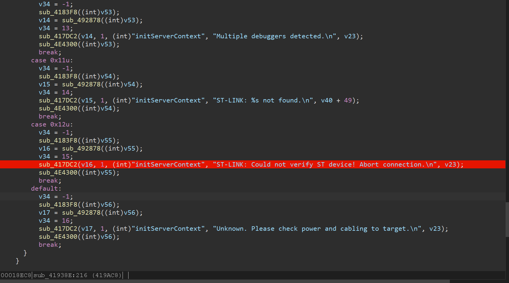
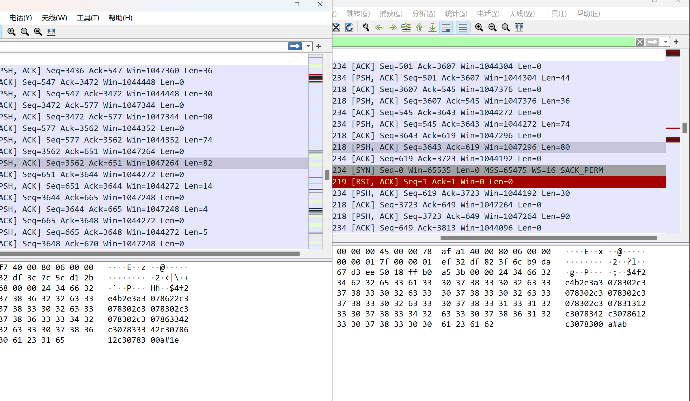

# HackSTLinkGDB
破解STM32CubeIDE的芯片正版验证

## 如何使用
用SetDll将dll注入到STM32CubeIDE目录下的stlinkgdb-server.exe
todo: 详细步骤

## 分析
若是国产芯片或盗版ST芯片在烧录或调试时会显示`Not a genuine St Device! Abort connection`，Keil可以通过修改后继续烧录，STM32CubeIDE用网上的方法无法绕过。虽然现在用Clion或VScode，但难保有一天gdb添加了验证功能，留个记录供参考。
已尝试方法：
- [修改CPUTAPID](https://electronics.stackexchange.com/questions/681952/how-to-make-new-versions-of-stm32cubeide-1-9-to-debug-fake-stm32-chips)
- [外部启动gdbserver](https://www.cnblogs.com/DragonStart/p/12199455.html)  
  
用IDA进行分析`ST-LINK_gdbserver.exe`，0x40D6AC函数为判断连接状态，其中0x40D7EC函数返回0x12时为检测到盗版芯片  
  
可见Patch一下即可，但STM32CubeIDE还检测单片机的ID，由于gdb是通过socket通信的，可以用wireshark抓包对比一下正版和盗版。  
  
结合IDA调试可见有一段类似于验证，通过dll注入修改ws2_32的send函数并修改最终能正常使用。检测是否为验证通信的逻辑有待改善，但此方法可令STM32CubeIDE正常调试  

## TODO
- [ ] 完善文档
- [ ] DLL内实现Patch验证函数
- [ ] 分析验证函数是读取的单片机的哪段地址
- [ ] 分析STM32Cube产品（貌似是ST自己写的jvm？）
